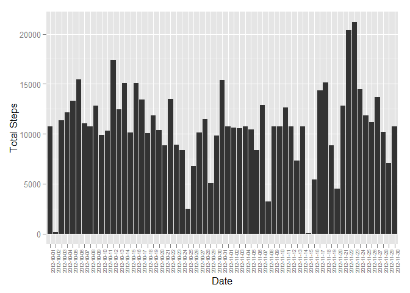

# Reproducible Research: Peer Assessment 1

This documents summarises findings from the analysis of  data from a personal activity monitoring device. This device collects data at 5 minute intervals through out the day. The data consists of two months of data from an anonymous individual collected during the months of October and November, 2012 and include the number of steps taken in 5 minute intervals each day.


```r
#Setting global options
library(knitr)
opts_chunk$set(echo = TRUE)
options(scipen = 999)
```

## Loading and preprocessing the data

The data underpinning this analysis is available at [Activity monitoring data](https://d396qusza40orc.cloudfront.net/repdata%2Fdata%2Factivity.zip).

The code below unzips this data set (located in the current working directory) and reads the data into R.


```r
library(dplyr)
```

```
## 
## Attaching package: 'dplyr'
## 
## The following objects are masked from 'package:stats':
## 
##     filter, lag
## 
## The following objects are masked from 'package:base':
## 
##     intersect, setdiff, setequal, union
```

```r
unzip("activity.zip")
activity <- read.csv("activity.csv", stringsAsFactors = FALSE)
```

## What is mean total number of steps taken per day?

A histogram illustrating the total number of steps for each day of the study is provided below. Missing values have been ignored.


```r
stepsperday <- activity %>%
        group_by(date) %>%
        summarise(DailySteps = sum(steps))

library(ggplot2)        
g <- ggplot(stepsperday, aes(x = date, y = DailySteps))
g + geom_histogram(stat = "identity") +
        theme(axis.text.x = element_text(angle = 90, hjust = 1, size = 6))+
        xlab("Date") +
        ylab("Total Steps")
```

```
## Warning: Removed 8 rows containing missing values (position_stack).
```

 

The mean and median steps per day (ignoring missing values) has also been calculated.


```r
meansteps <- mean(stepsperday$DailySteps, na.rm = TRUE)
mediansteps <- median(stepsperday$DailySteps, na.rm = TRUE)
```

The mean steps per day is **10766.1886792** and the median steps per day is **10765**.

## What is the average daily activity pattern?

The interval variable provides an identifier representing the 5-minute interval for which a measurement was taken by the monitoring device.

A time series plot of the average number of steps taken for each 5-minute interval has been generated, averaged across days.


```r
intervalave <- activity %>%
        group_by(interval) %>%
        summarise(AveSteps = mean(steps, na.rm = TRUE))
        
h <- ggplot(intervalave, aes(x = interval, y = AveSteps))
h + geom_line() +
        xlab("Interval") +
        ylab("Average Steps")
```

 

The interval with the maximum average steps per day has also been calculated.


```r
maxinterval <- intervalave %>%
        filter(AveSteps == max(AveSteps)) %>%
        select(interval) %>%
        as.integer()
```

The interval with the maximum average steps per day is **835** with an average of **206.1698113**.

## Imputing missing values

The data set contains a number of days/intervals where there are missing values (coded as NA). The total number of missing values in the data set has been calculated and reported in the table below. All missing values appear in the "steps" variable.


```r
library(xtable)
na_count <- sapply(activity, function(y){sum(length(which(is.na(y))))})
na_count <- data.frame(na_count)
na_count <- xtable(na_count)
print(na_count, type = "html")
```

<!-- html table generated in R 3.2.1 by xtable 1.7-4 package -->
<!-- Thu Sep 17 12:29:38 2015 -->
<table border=1>
<tr> <th>  </th> <th> na_count </th>  </tr>
  <tr> <td align="right"> steps </td> <td align="right"> 2304 </td> </tr>
  <tr> <td align="right"> date </td> <td align="right">   0 </td> </tr>
  <tr> <td align="right"> interval </td> <td align="right">   0 </td> </tr>
   </table>

The presence of missing days may introduce bias into some calculations or summaries of the data. Therefore, missing values have been imputed using the mean for the 5-minute interval corresponding to the missing value. A new data set equal to the original data set but with the missing data filled in has been generated.


```r
activity_imputed <- merge(activity, intervalave, by.x = "interval", by.y = "interval", all.x = TRUE) %>%
        mutate(newsteps = ifelse(is.na(steps) == TRUE, AveSteps,steps)) %>%
        select(newsteps, date, interval) %>%
        rename(steps = newsteps) %>%
        arrange(date, interval)

stepsperday_imputed <- activity_imputed %>%
        group_by(date) %>%
        summarise(DailySteps = sum(steps))
```

A histogram of the total number of steps taken each day has been generated. The mean and median total number of steps taken per day of the imputed data set is also calculated.


```r
i <- ggplot(stepsperday_imputed, aes(x = date, y = DailySteps))
i + geom_histogram(stat = "identity") +
        theme(axis.text.x = element_text(angle = 90, hjust = 1, size = 6))+
        xlab("Date") +
        ylab("Total Steps")
```

 

```r
mean_imputedsteps <- mean(stepsperday_imputed$DailySteps, na.rm = TRUE)
med_imputedsteps <- median(stepsperday_imputed$DailySteps, na.rm = TRUE)
```

Both the mean and median steps per day using the imputed data set has been calculated as **10766.1886792**.

The mean value using imputed data through the method above does not differ from the mean calculated which ignores missing values. The median has changed from **10765** to **10766.1886792**, which is a very minor change.  

As illustrated by the histogram above, the use of imputed data has resulted in minor changes to the estimates of the total daily number of steps. The changes are most noticeable on those days in which no data was previously recorded.  

## Are there differences in activity patterns between weekdays and weekends?

The difference between activity patterns between weekdays and weekends is illustrated by the panel plot below. This plot has been created using a new factor variable that distinguishes weekdays and weekends.


```r
library(lubridate)

weekly_patterns <- activity_imputed %>%
        mutate(date = ymd(date)) %>%
        mutate(DayType = weekdays(date)) %>%
        mutate(DayType = as.factor(ifelse(DayType == "Saturday" | DayType == "Sunday", "Weekend", "Weekday"))) %>%
        group_by(interval, DayType) %>%
        summarise(AveSteps = mean(steps))

j <- ggplot(weekly_patterns, aes(x = interval, y = AveSteps))
j + geom_line() + facet_grid(. ~ DayType) +
        xlab("Interval") +
        ylab("Average Steps")
```

 

This plot demonstrates that there is a difference in activity patterns between weekdays and weekends, including:

* a generally more "flatter" structure on weekends
* the absence of the visible spike on weekday mornings
* increased activity throughout the afternoon and into the evening on weekends
